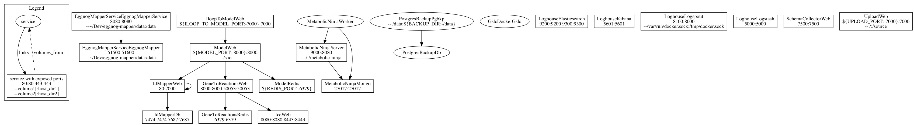

The documentation of DD-DeCaF platform (infrastructure and dependencies) will be collected here.

The APIs documentation powered by Swagger is on [https://docs.dd-decaf.eu](https://docs.dd-decaf.eu)

The overview of all the docker containers and their communication
